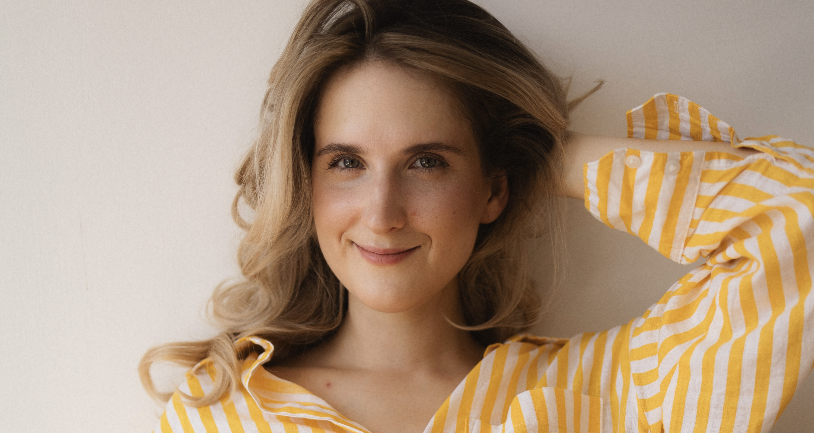
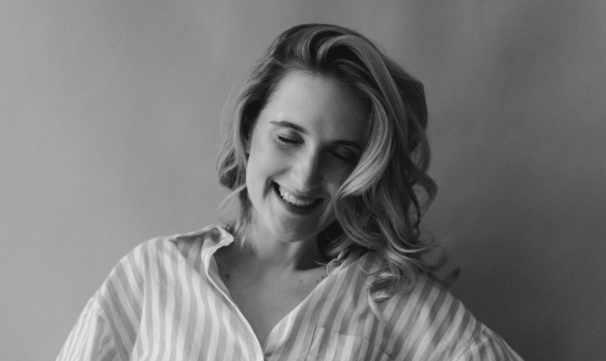

# Why I coach: my personal journey

## Roots in Ukraine, wings around the world

I was born in 1992, in the aftermath of the Soviet Union’s collapse, a time of
uncertainty and hardship for many, including my own family. When I was just 6
years old, my parents separated, and my mother made the difficult decision to
emigrate to Cyprus in search of a better future. As a child, I stayed in
Poltava, clinging to the familiarity of home. But by the age of 12, I followed
my mother’s footsteps, leaving behind everything I knew to join her in a new
country. That chapter of my life marked the beginning of a journey that would
shape who I am today.

Emigrating to Cyprus was one of the hardest moments of my life. I had to learn
Greek at record speed, start at a new school, and make new friends—all while
navigating the challenges of being a teenager in an unfamiliar world. Cyprus is
now a place I call my second home, one I cherish and return to often.

At 18, I moved to Italy to pursue my studies in communication. I set a goal not
only to master the Italian language but also to find a part-time job to support
myself while studying. After graduation, I made the bold decision to close the
chapter on my life in Europe and return to Ukraine, hoping to find my first job
and apply my language skills and international experience in my home country.

Shortly after, I landed my first job at the language learning startup Preply,
joining when it was just 40 people. I quickly established myself as a
communication expert and grew to lead the copywriting department. After five
years and several investment rounds, I left the company to pursue an offer from
a French unicorn and relocate to Paris, France, where I now live with my family.

## From leading teams to empowering lives

While writing my 2024 resolutions, I dared to put into words a phrase that had
been swirling in my head for years: "I want to leave my job."

Working in a dynamic and successful company, holding a prestigious leadership
role in one of the biggest fintech firms in France, I was proud of my
achievements. For years, I had led teams that shaped user stories and delivered
impactful solutions. Yet, amidst all this professional success, I came to a
profound realization—I was helping everyone but myself.

Six years ago, when I stepped into my first leadership role, my main motivation
was simple: **people**. I wanted to help them discover their true strengths,
grow in their roles, and feel motivated and fulfilled. However, as the years
went by, I realized that people management was only a small part of my
day-to-day responsibilities. With each passing year, the demands of my role
pulled me further away from what I truly enjoyed. What once felt meaningful
began to feel less fulfilling, and I started to question whether I was truly
aligned with my purpose.

## A leap of faith: my path to coaching

In 2023, I took a leap of faith and completed my ACTP at the International
Coaching Competence Academy. Coaching my first clients as an ICF certified coach
was a transformative experience—it was as if everything clicked. I had a
profound revelation: there is a way out, and I was exactly where I needed to be.

By 2024, I was ready to fully embrace coaching as my career. The more I coached,
the more I felt a deep sense of alignment with my purpose. What started as a
dream in 2023 turned into a reality in 2024, as I made the decision to step away
from shaping user stories and dedicate myself fully to empowering individuals to
reshape their own lives.

I craved more connection and impact, and working directly with clients was
giving me exactly that. It also fulfilled my creativity, sparked inspiration,
and left me in pure awe of the personalities I was meeting.
