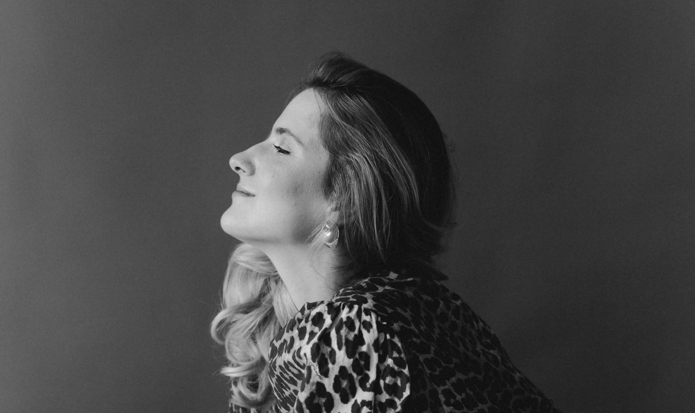

# What clients say: transformative coaching experiences

Here’s what some of my clients have shared about their experiences working with me:

"Working with Kate has been an absolute game-changer! Her energy and enthusiasm create a positive and motivating atmosphere. She listens deeply, asks thought-provoking questions, and helps you uncover solutions you didn’t even know you had in you.

Each session feels tailored to my journey, with just the right mix of encouragement and challenge. I’ve seen real progress thanks to her guidance and couldn’t be more grateful. Truly an exceptional coach!"

— Daria L.

"First, I’m grateful for finding a coach like Kate and our sessions that helped me to look back into my career path with more empathy and value more what I’ve done.
Kate helped me to bring clarity on why I stuck in my career. I really like her approach in coaching. She was asking deep questions that made me reflect a lot on my career path. She guided to understand better what will work best for me to be truly happy with the decision rather than just following external signals and trends. Ive got good insight about self validation and understanding what are my needs in the ideal work environment. She helped me to understand that each change is the process, even coaching is about the process just like therapy.
Thanks!"

— Marta R. 

"Working with Kate was an incredible and transformative experience. Over the course of just five sessions, I gained profound insights into why I was feeling stuck and uncovered several blind spots that were holding me back. Kate’s deep, thoughtful, and timely questions led to many personal discoveries, some of which extended far beyond the original scope of my goals.

Her ability to offer genuine support while highlighting areas where I underestimated or overly criticized myself was truly invaluable. Each session felt tailored to my unique needs, and her flexibility with scheduling made the process even smoother. Beyond her coaching skills, Kate is an incredibly warm and open person. She radiates kindness and support, creating an environment where you feel safe to explore your thoughts and challenges.

I couldn’t have asked for a better coach. Kate’s approach helped me see myself and my potential in a new light, and I’m so grateful for the growth I’ve experienced through our work together. Highly recommended!"

— Yana A.

"Kate's help was invaluable. We had three sessions. I requested that my performance highlights be figured out. Together, we identified my strengths and areas for career development. Additionally, Kate helped me structure and even write my updated CV."

— Anastasia L.

"Kate's greatest talent is to uncover your believe system by meticulously paying attention to every word you say and every gesture you make. You can't hide from her ability to read you, which she does at an incredible speed. That's what makes each session so effective and valuable."

- Pauline

"I went into the process just as an experiment, to see how coaching can help me with my work/life balance and cement a good habit I started.

Oh boy, how far that goal was from what really mattered. Kate helped me “dig out” a much bigger and important problem, helping me move forward with a truly pivotal decision in life of me and my family. Coaching helped me to see clearly the real challenges I have, reflect back on the strategies I use to cope with them and challenge myself to do better. All the way, Kate was receptive and open in our conversation, never going into advice mode, but just gently guiding me to answer (sometimes tough) questions by myself, very rewarding process IMO. I especially liked the way we did course correction in the early-mid stage of our sessions and how Kate noticed that things were “going South” and proactively suggested a new plan that worked terrifically!

As a result, Kate and I found the real problem and were able to arrive at the solution through our collaboration. That for me is a true showcase of a good work! Thanks!"

- Anonymous 

"The coaching sessions helped me to understand myself much better and get a better life goals, smth that I really want."

- Myroslav

